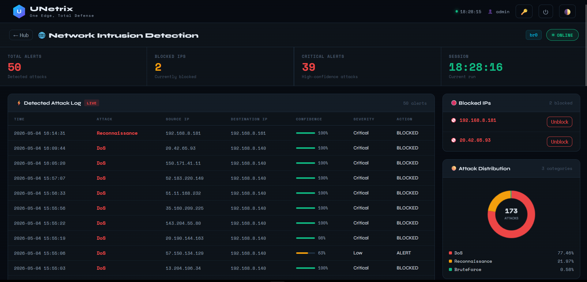
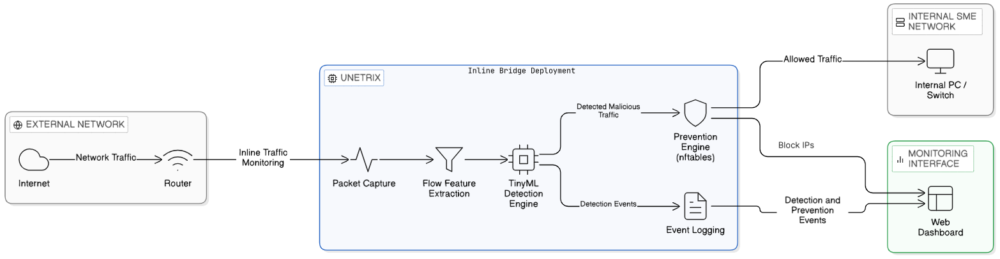
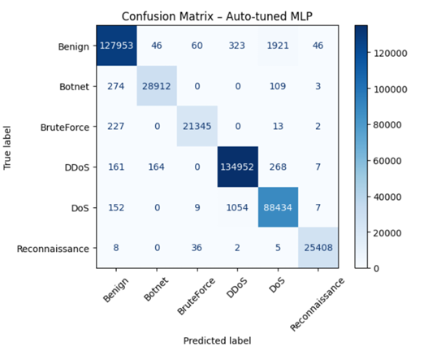
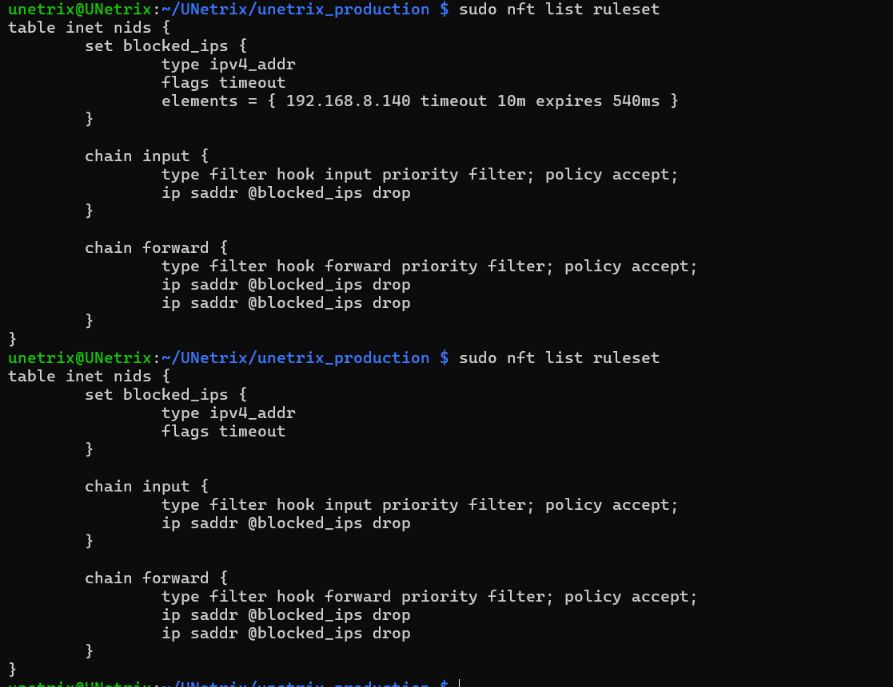

# UNETRIX-NIDPS
UNETRIX NIDPS – Lightweight Network Intrusion Detection and Prevention System for Raspberry Pi using TensorFlow Lite and nftables.

# TinyML-Powered Real-Time Network Threat Detection & Prevention for SMEs

<div align="center">


**TinyML-Based Network Intrusion Detection and Prevention System (NIDPS) for Small and Medium-Sized Enterprises (SMEs)**

Bachelor of Science (Hons) in Information Technology Specialized in Cyber Security
Sri Lanka Institute of Information Technology (SLIIT)

</div>

---

## Overview

This research presents a lightweight **Network Intrusion Detection and Prevention System (NIDPS)** designed for deployment on resource-constrained edge devices such as the Raspberry Pi 4.

The solution combines:

* Real-time packet capture
* Flow-based feature extraction
* Machine Learning attack classification
* TensorFlow Lite deployment
* Automated threat prevention using nftables
* Web dashboard monitoring

The system was developed as part of the **UNETRIX Smart Edge Security Device** project and focuses on providing an affordable cybersecurity solution for Small and Medium-Sized Enterprises (SMEs).

---

## Key Features

### Real-Time Threat Detection

Detects malicious network traffic in real time using a lightweight MLP model.

### TinyML Deployment

Optimized TensorFlow Lite model suitable for Raspberry Pi deployment.

### Automated Prevention

Automatically blocks malicious IP addresses using nftables when attack confidence exceeds the defined threshold.

### Lightweight Edge Computing

Designed specifically for resource-constrained environments.

### Dashboard Monitoring

Provides:

* Attack classification
* Source IP tracking
* Confidence scores
* Block status
* Alert history

---

# System Architecture

```text
                    ┌──────────────────┐
                    │ Internet Router  │
                    └─────────┬────────┘
                              │
                              ▼
                ┌──────────────────────────┐
                │ Raspberry Pi 4 (NIDPS)   │
                │                          │
                │  Packet Capture          │
                │          ↓               │
                │ Feature Extraction       │
                │          ↓               │
                │ TensorFlow Lite Model    │
                │          ↓               │
                │ Attack Classification    │
                │          ↓               │
                │ nftables Prevention      │
                │          ↓               │
                │ Dashboard Logging        │
                └─────────┬────────────────┘
                          │
                          ▼
                   Internal Network
```

---

# Detection Pipeline

```text
Live Traffic
     ↓
Packet Capture
     ↓
Flow Generation
     ↓
Feature Extraction
     ↓
Feature Scaling
     ↓
TensorFlow Lite Inference
     ↓
Attack Prediction
     ↓
Confidence Evaluation
     ↓
nftables IP Blocking
     ↓
Dashboard Alert
```

---

# Attack Classes

The final model classifies network traffic into six categories:

| Class          |
| -------------- |
| Benign         |
| DoS            |
| DDoS           |
| Brute Force    |
| Botnet         |
| Reconnaissance |

---

# Dataset

Datasets used:

* CICIDS2017
* CSE-CIC-IDS2018

### Dataset Processing

The datasets were:

* Cleaned
* Harmonized
* Relabeled
* Balanced

to create a final six-class dataset suitable for deployment.

---

# Feature Selection

Random Forest Feature Importance was used to reduce the original feature space.

### Final Selected Features

| #  | Feature                  |
| -- | ------------------------ |
| 1  | Init Fwd Win Bytes       |
| 2  | Fwd Seg Size Min         |
| 3  | Fwd Header Length        |
| 4  | Init Bwd Win Bytes       |
| 5  | Bwd Packet Length Mean   |
| 6  | Bwd Packet Length Std    |
| 7  | Subflow Fwd Bytes        |
| 8  | Fwd Packet Length Max    |
| 9  | Fwd Packets Length Total |
| 10 | Bwd Header Length        |
| 11 | Avg Bwd Segment Size     |
| 12 | Fwd Packet Length Mean   |
| 13 | Bwd Packets/s            |
| 14 | Subflow Bwd Bytes        |
| 15 | Avg Fwd Segment Size     |
| 16 | Packet Length Std        |
| 17 | Fwd IAT Total            |
| 18 | Packet Length Max        |
| 19 | Total Fwd Packets        |
| 20 | Avg Packet Size          |

---

# Machine Learning Model

### Final Model

| Parameter         | Value      |
| ----------------- | ---------- |
| Model             | MLP        |
| Hidden Layers     | 3          |
| Layer 1           | 32 Neurons |
| Layer 2           | 32 Neurons |
| Layer 3           | 64 Neurons |
| Learning Rate     | 0.001      |
| Batch Size        | 128        |
| Epochs            | 50         |
| Optimizer         | Adam       |
| Output Activation | Softmax    |

---

# Performance Results

## Model Performance

| Metric                     | Result    |
| -------------------------- | --------- |
| Accuracy                   | 98.87%    |
| TensorFlow Lite Model Size | 18.96 KB  |
| Pure Inference Time        | 0.0202 ms |
| Preprocessing + Inference  | 3.8578 ms |

---

## Resource Usage Analysis

| Component           | Avg CPU | Max CPU | Avg RAM   |
| ------------------- | ------- | ------- | --------- |
| Raspberry Pi System | 12.62%  | 38.60%  | 374.74 MB |
| Inference Process   | 1.20%   | 4.00%   | 138.53 MB |
| Dumpcap             | 0.03%   | 1.00%   | 8.43 MB   |

---

# Prevention Mechanism

The NIDPS includes an automated prevention layer using nftables.

### Prevention Workflow

1. Detect malicious traffic
2. Evaluate prediction confidence
3. Identify source IP
4. Add IP to nftables block set
5. Apply timeout-based blocking
6. Log event to dashboard

### Blocking Policy

```text
Confidence > Threshold
        ↓
Block Source IP
        ↓
10 Minute Timeout
        ↓
Automatic Removal
```

This prevents permanent blocking while still providing immediate response to threats.

---

# Dashboard

The web dashboard provides:

* Attack Type
* Source IP Address
* Destination IP Address
* Confidence Score
* Timestamp
* Block Status
* Alert History

---

# Screenshots

## Dashboard

```text
docs/screenshots/dashboard.png
```



---

## Architecture Diagram

```text
docs/screenshots/architecture.png
```



---

## Confusion Matrix

```text
docs/screenshots/confusion_matrix.png
```



---

## nftables Validation

```text
docs/screenshots/nftables_blocking.png
```



---

# Project Structure

```text
UNETRIX-NIDPS
│
├── README.md
├── requirements.txt
├── LICENSE
│
├── docs
│   ├── thesis.pdf
│   ├── screenshots
│   ├── architecture.png
│   ├── dashboard.png
│   └── confusion_matrix.png
│
├── model
│   ├── model.tflite
│   └── scaler.pkl
│
├── src
│   ├── packet_capture.py
│   ├── feature_extraction.py
│   ├── inference.py
│   ├── nftables_blocker.py
│   ├── dashboard_api.py
│   └── main.py
│
├── notebooks
│   └── training.ipynb
│
└── results
```

---

# Installation

## Clone Repository

```bash
git clone https://github.com/TharushaThilakarathna/UNETRIX-NIDPS.git

cd UNETRIX-NIDPS
```

## Create Virtual Environment

```bash
python -m venv venv

source venv/bin/activate
```

Windows:

```bash
venv\Scripts\activate
```

## Install Dependencies

```bash
pip install -r requirements.txt
```

---

# Run Detection Engine

```bash
python src/main.py
```

---

# Technologies Used

* Python
* TensorFlow Lite
* Scikit-learn
* Raspberry Pi OS
* nftables
* Flask
* Dumpcap
* Wireshark Utilities
* Pandas
* NumPy

---

# Research Contribution

This research addresses the gap between high-accuracy intrusion detection models and practical edge deployment by combining:

* Lightweight TinyML inference
* Real-time traffic monitoring
* Automated prevention
* Dashboard visibility
* SME affordability

into a single deployable solution.

---

# Author

### Tharusha Dilshan

Cybersecurity Undergraduate
Sri Lanka Institute of Information Technology (SLIIT)

LinkedIn: https://linkedin.com/in/tharusha-dilshan-225b12315

GitHub: https://github.com/TharushaThilakarathna

Email: [stdthilakarathna@gmail.com](mailto:stdthilakarathna@gmail.com)

---

# Citation

If you use this work, please cite:

```bibtex
@thesis{thilakarathna2025nidps,
  author = {Thilakarathna, Tharusha Dilshan},
  title = {TinyML-Powered Real-Time Network Threat Detection and Prevention for SMEs},
  University = {Sri Lanka Institute of Information Technology},
  year = {2025}
}
```

---

# License

This project is released under the MIT License.

See the LICENSE file for details.

---

⭐ If you found this project useful, consider giving it a star.
